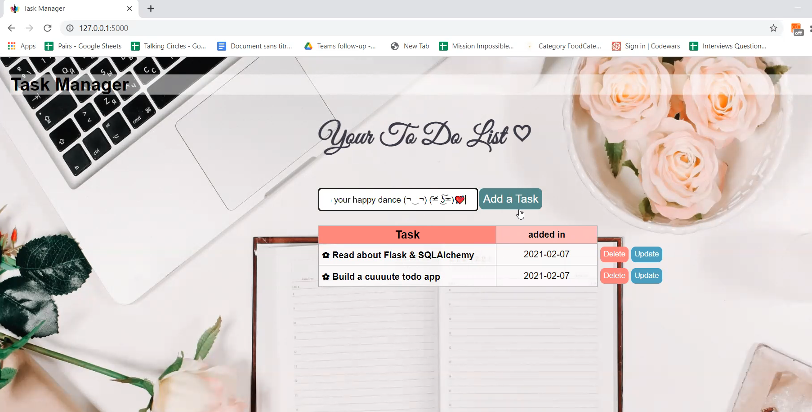

# FlaskToDoApp 📑✔️
📋 Learning Flask Through a small, elegant Task Manager (ToDoApp) that allows you to ADD , DELETE, and UPDATE tasks.

## Live DEMO 🎬 🔽

## Stack Used💻
- Frontend : HTML & CSS
- Backend : Flask 
- Database : SQLALchemy

<<<<<<< HEAD

## How to get started ⌨️
=======
## How to get started 
>>>>>>> cceff5fca864c894ed0aeb7f9b2f6365aa077992
- Install the latest version of python
- Download or clone the repo
- Open it in a code editor
- Activate the virtual enviroment : venv/Scripts/activate
- run the command : pip install flask flask-sqlalchemy
- Run the surver : python app.py 

